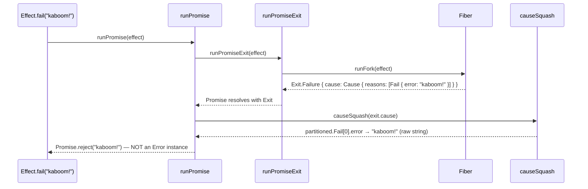

# Effect v4 + TanStack Start Server Fn Error Handling

> **Status: Approach 2 implemented** in `src/lib/effect-services.ts:60-71`

## Problem (solved)

`runEffect` (`src/lib/effect-services.ts:46-47`) calls `Effect.runPromise`, which on failure calls `causeSquash(cause)` and throws the **raw error value** — e.g. `Effect.fail("kaboom!")` throws the string `"kaboom!"`.

TanStack Start serializes thrown values via seroval and on the client checks `if (result instanceof Error) throw result`. A raw string isn't an `Error`, so the error path falls through to a generic "unexpected error occurred" message.

### Previous `runEffect`

```ts
// src/lib/effect-services.ts
export const makeRunEffect = (env: Env) => {
  const appLayer = makeAppLayer(env);
  return <A, E>(effect: Effect.Effect<A, E, AppR>) =>
    Effect.runPromise(Effect.provide(effect, appLayer));
};
```

### `runPromise` internals (`refs/effect4`)

```ts
// internal/effect.ts:4802-4814
export const runPromiseWith = <R>(services: ServiceMap.ServiceMap<R>) => {
  const runPromiseExit = runPromiseExitWith(services);
  return <A, E>(
    effect: Effect.Effect<A, E, R>,
    options?: Effect.RunOptions,
  ): Promise<A> =>
    runPromiseExit(effect, options).then((exit) => {
      if (exit._tag === "Failure") {
        throw causeSquash(exit.cause); // <-- rejects with raw E, not Error
      }
      return exit.value;
    });
};
```

```ts
// internal/effect.ts:299-309 — causeSquash priority
export const causeSquash = <E>(self: Cause.Cause<E>): unknown => {
  const partitioned = causePartition(self);
  if (partitioned.Fail.length > 0) return partitioned.Fail[0].error; // raw E
  if (partitioned.Die.length > 0) return partitioned.Die[0].defect; // raw defect
  if (partitioned.Interrupt.length > 0)
    return new Error("All fibers interrupted without error");
  return new Error("Empty cause");
};
```



`Effect.fail("kaboom!")` → `causeSquash` returns `"kaboom!"` (the raw `E`). TanStack Start checks `result instanceof Error` — a string fails that check → client shows "An unexpected error occurred."

If `E` is already an `Error` subclass (e.g. `Effect.fail(new MyError())`), `causeSquash` returns the `Error` instance and serialization works.

---

## Approach 1: `runPromiseExit` in `runEffect`

Change `runEffect` to use `runPromiseExit` so it never rejects with a raw value. Inspect the `Exit` and throw a proper `Error` instance.

### Implementation

```ts
// src/lib/effect-services.ts
import { Cause, Effect, Exit, Layer, ServiceMap } from "effect";

export const makeRunEffect = (env: Env) => {
  const appLayer = makeAppLayer(env);
  return async <A, E>(effect: Effect.Effect<A, E, AppR>): Promise<A> => {
    const exit = await Effect.runPromiseExit(Effect.provide(effect, appLayer));
    if (Exit.isSuccess(exit)) return exit.value;
    throw new Error(Cause.pretty(exit.cause));
  };
};
```

`runPromiseExit` always resolves (never rejects). It forks a fiber and resolves with the `Exit` when done:

```ts
// internal/effect.ts:4785-4799
export const runPromiseExitWith = <R>(services: ServiceMap.ServiceMap<R>) => {
  const runFork = runForkWith(services);
  return <A, E>(
    effect: Effect.Effect<A, E, R>,
    options?: Effect.RunOptions,
  ): Promise<Exit.Exit<A, E>> => {
    const fiber = runFork(effect, options);
    return new Promise((resolve) => {
      fiber.addObserver((exit) => resolve(exit));
    });
  };
};
```

```ts
// Exit.ts:102 — discriminated union
type Exit<A, E = never> = Success<A, E> | Failure<A, E>;

// Exit.ts:147-150
interface Success<A, E> {
  readonly _tag: "Success";
  readonly value: A;
}

// Exit.ts:178-181
interface Failure<A, E> {
  readonly _tag: "Failure";
  readonly cause: Cause.Cause<E>;
}
```

`exit.cause` is a `Cause<E>` containing a `reasons: ReadonlyArray<Fail<E> | Die | Interrupt>`:

```ts
// Cause.ts:405-407 — Fail holds the typed E
interface Fail<E> {
  readonly _tag: "Fail";
  readonly error: E;
}

// Cause.ts:377-379 — Die holds untyped defects (Effect.die, uncaught throws)
interface Die {
  readonly _tag: "Die";
  readonly defect: unknown;
}

// Cause.ts:433-435 — Interrupt
interface Interrupt {
  readonly _tag: "Interrupt";
  readonly fiberId: number | undefined;
}
```

`Cause.pretty(cause)` produces a human-readable multi-line string suitable for `new Error(...)` messages.

### Pros

- Single-file change fixes serialization for all server fns
- No per-fn boilerplate
- `errorComponent` receives a proper `Error` with a readable message

### Cons

- Loses typed error information at the boundary (everything becomes `Error` with a message string)
- Can't do `redirect`/`notFound` from within Effect unless you add special handling

---

## Approach 2: Hybrid — structured `runEffect` with TanStack escape hatches

Build on Approach 1 but detect `redirect`/`notFound` objects that were placed in the defect channel via `Effect.die`, passing them through to TanStack's control flow.

### `redirect()` and `notFound()` — neither is an `Error`

`redirect()` returns a `Response` (web standard), not an `Error`:

```ts
// tan-router/packages/router-core/src/redirect.ts:10-19
type Redirect = Response & {
  options: NavigateOptions;
  redirectHandled?: boolean;
};

// Implementation: creates new Response(null, { status: 307, headers }), attaches .options
```

`notFound()` returns a plain object, not an `Error`:

```ts
// tan-router/packages/router-core/src/not-found.ts:4-19
type NotFoundError = {
  global?: boolean;
  data?: any;
  throw?: boolean;
  routeId?: string;
  headers?: HeadersInit;
};

// Implementation: mutates options with isNotFound = true, returns the object
```

Type guards:

```ts
// isRedirect: obj instanceof Response && !!obj.options
// isNotFound: !!obj?.isNotFound
```

Since neither is an `Error` subclass, both pass through `causeSquash` as raw values. The `runEffect` checks `isRedirect`/`isNotFound` before wrapping in `Error`.

### Implementation

```ts
// src/lib/effect-services.ts
import { isNotFound, isRedirect } from "@tanstack/react-router";
import { Cause, Effect, Exit, Layer, ServiceMap } from "effect";

export const makeRunEffect = (env: Env) => {
  const appLayer = makeAppLayer(env);
  return async <A, E>(effect: Effect.Effect<A, E, AppR>): Promise<A> => {
    const exit = await Effect.runPromiseExit(Effect.provide(effect, appLayer));
    if (Exit.isSuccess(exit)) return exit.value;
    const squashed = Cause.squash(exit.cause);
    if (isRedirect(squashed) || isNotFound(squashed)) throw squashed;
    throw squashed instanceof Error
      ? squashed
      : new Error(Cause.pretty(exit.cause));
  };
};
```

### Usage in effect pipelines

Use `Effect.die` to escape to TanStack control flow — appropriate because `redirect`/`notFound` are control flow, not recoverable errors:

```ts
import { notFound, redirect } from "@tanstack/react-router";

const getLoaderData = createServerFn({ method: "GET" })
  .inputValidator(Schema.toStandardSchemaV1(organizationIdSchema))
  .handler(({ data: { organizationId }, context: { runEffect, session } }) =>
    runEffect(
      Effect.gen(function* () {
        const validSession = yield* Effect.fromNullishOr(session).pipe(
          Effect.catch(() => Effect.die(redirect({ to: "/login" }))),
        );
        const repository = yield* Repository;
        return yield* repository.getAppDashboardData({
          userEmail: validSession.user.email,
          organizationId,
        });
      }),
    ),
  );
```

### Pros

- Centralized error→Error conversion for all server fns
- TanStack `redirect`/`notFound` work from within Effect pipelines
- Domain errors can be handled per-fn with `catchTag`/`catchTags`

### Cons

- Using `Effect.die` for control flow is unconventional in Effect
- Slightly more complex `runEffect`

---

## Key Reference: How `causeSquash` Works

`Effect.runPromise` throws via `causeSquash`, which returns (in priority order):

1. First `Fail` reason's `.error` (the raw `E` value)
2. First `Die` reason's `.defect` (the raw `unknown` value)
3. `Error("All fibers interrupted without error")`
4. `Error("Empty cause")`

This is why `Effect.fail("kaboom!")` throws the string `"kaboom!"` — it's the raw `E` from the first `Fail` reason.

## Key Reference: TanStack Start Server Fn Error Flow

```
handler throws
  → caught by middleware try/catch
  → serialized via seroval (toCrossJSONAsync)
  → sent as HTTP 500 with X_TSS_SERIALIZED header
  → client deserializes via fromCrossJSON
  → if (result instanceof Error) throw result  ← string fails this check
  → error propagates to router loader catch
  → route.onError?.(error)
  → match.status = 'error'
  → route.errorComponent renders with { error, reset }
```

## Key Reference: `Effect.fromNullishOr` and `NoSuchElementError`

```ts
const validSession = yield * Effect.fromNullishOr(null);
```

This fails the effect with `NoSuchElementError` — a typed failure in the `E` channel:

```ts
// internal/effect.ts:928-929
export const fromNullishOr = <A>(
  value: A,
): Effect<NonNullable<A>, Cause.NoSuchElementError> =>
  value == null ? fail(new NoSuchElementError()) : succeed(value);
```

`NoSuchElementError` IS an `Error` subclass (inheritance: `globalThis.Error → YieldableError → TaggedError("NoSuchElementError") → NoSuchElementError`). It has `_tag: "NoSuchElementError"`, `name: "NoSuchElementError"` (set on prototype, NOT an own property), and `stack`.

**Through `runEffect` (Approach 2):** `Cause.squash` extracts `Fail[0].error` → the `NoSuchElementError` instance → it IS `instanceof Error` so `runEffect` throws it. But the error undergoes **two different serialization paths** depending on context:

### SSR path: `ShallowErrorPlugin` strips everything except `.message`

During SSR, the server fn is called directly (no HTTP round trip). The error is caught by the router, stored on the match, and **dehydrated to the client** via TanStack Router's `ShallowErrorPlugin` — a seroval plugin at `@tanstack/router-core/dist/esm/ssr/serializer/ShallowErrorPlugin.js`:

```ts
// ShallowErrorPlugin — only serializes .message, nothing else
const ShallowErrorPlugin = createPlugin({
  tag: "$TSR/Error",
  test(value) {
    return value instanceof Error;
  },
  parse: {
    sync(value, ctx) {
      return { message: ctx.parse(value.message) };
    },
    // ...
  },
  serialize(node, ctx) {
    return "new Error(" + ctx.serialize(node.message) + ")";
  },
  deserialize(node, ctx) {
    return new Error(ctx.deserialize(node.message));
  },
});
```

This plugin **only captures `.message`** — `.name`, `._tag`, `.stack`, and all custom properties are stripped. On the client it creates `new Error(message)`.

For `NoSuchElementError` constructed without an argument:

- Effect's `TaggedError` base sets `.name = "NoSuchElementError"` on the **prototype** (not own property)
- The constructor calls `super({ message: undefined })`, and Effect's `Error` base does `Object.assign(this, { message: undefined })` — setting `.message = undefined` as an **own property**
- `ShallowErrorPlugin.parse` captures `{ message: undefined }`
- `ShallowErrorPlugin.deserialize` creates `new Error(undefined)` → `.name = "Error"`, `.message = ""`
- Catch boundary: `"" || "An unexpected error occurred"` → shows the generic fallback

### Client-side RPC path: seroval serialization

When the server fn is called via HTTP (client-side navigation), TanStack Start serializes errors via seroval with its own plugins. The `ShallowErrorPlugin` also applies here (registered via `serovalPlugins` in the server fn handler).

### Fix: normalize `.message` in `runEffect` (implemented)

Since `ShallowErrorPlugin` only preserves `.message`, the fix is in `runEffect` — ensure the thrown Error always has a non-empty `.message` before it reaches any serialization boundary:

```ts
// src/lib/effect-services.ts
const pretty = Cause.pretty(exit.cause);
if (squashed instanceof Error) {
  if (!squashed.message) squashed.message = squashed.name || pretty;
  throw squashed;
}
throw new Error(pretty);
```

This handles Effect errors like `NoSuchElementError` that have `.name` set but `.message` empty/undefined. The error boundary receives `"NoSuchElementError"` (or the full `Cause.pretty` output) instead of an empty string.

Note: `redirect`/`notFound` via `Effect.die` are for route-level control flow, NOT for server fns. Server fns should throw errors that the calling route's `errorComponent` can display.
