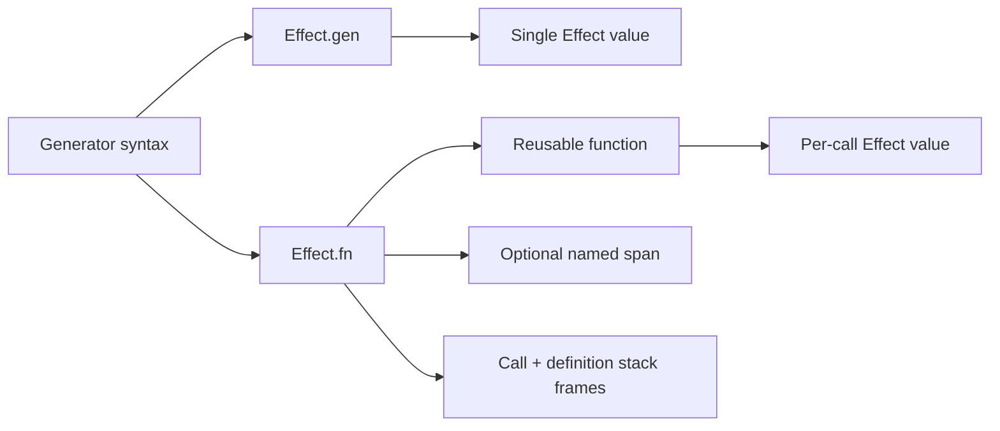

# Effect 4 Research: `Effect.gen` vs `Effect.fn`

## Scope

Sources reviewed:

- `refs/effect4/LLMS.md`
- `refs/effect4/packages/effect/src/Effect.ts`
- `refs/effect4/packages/effect/src/internal/effect.ts`
- `refs/effect4/ai-docs/src/01_effect/01_basics/01_effect-gen.ts`
- `refs/effect4/ai-docs/src/01_effect/01_basics/02_effect-fn.ts`
- `refs/effect4/ai-docs/src/03_integration/10_managed-runtime.ts`
- `refs/effect4/ai-docs/src/70_cli/10_basics.ts`
- `refs/effect4/migration/generators.md`

## Short Answer

`Effect.gen` and `Effect.fn` are related, not the same.

- `Effect.gen`: build one `Effect<A, E, R>` program value with generator syntax.
- `Effect.fn`: build a reusable function `(...args) => Effect<A, E, R>` from a generator body.

They solve different boundaries:

- `gen` solves effect workflow readability.
- `fn` solves reusable effect-function definition, naming, tracing, and call-site stack metadata.

Not fully interchangeable in practice.

## What They Are

### `Effect.gen`

Type shape from `Effect.ts`:

```ts
export const gen: {
  <Eff extends Yieldable<any, any, any, any>, AEff>(
    f: () => Generator<Eff, AEff, never>
  ): Effect<AEff, ...>
}
```

Source: `refs/effect4/packages/effect/src/Effect.ts:1564-1590`

Doc intent:

- "`gen` allows you to write code that looks and behaves like synchronous code".

Source: `refs/effect4/packages/effect/src/Effect.ts:1522-1525`

### `Effect.fn`

Export and docs:

```ts
export const fn: fn.Traced & {
  (name: string, options?: SpanOptionsNoTrace): fn.Traced
} = internal.fn
```

Source: `refs/effect4/packages/effect/src/Effect.ts:12849-12851`

Doc intent:

- "Creates a traced function ... adds spans and stack frames".

Source: `refs/effect4/packages/effect/src/Effect.ts:12823-12825`

Team guidance explicitly says:

- "When writing functions that return an Effect, use `Effect.fn`"
- "Avoid creating functions that return an `Effect.gen`, use `Effect.fn` instead."

Source: `refs/effect4/LLMS.md:48-52`

## Internal Mechanics (Why Behavior Differs)

Both are generator-based under the hood:

```ts
export const gen = (...) =>
  suspend(() => fromIteratorUnsafe(...))
```

Source: `refs/effect4/packages/effect/src/internal/effect.ts:1072-1093`

`fn` wraps that per call and adds function-level behavior:

- optional named span when first arg is a string
- call stack + definition stack frame enrichment
- optional post-processing pipeables
- preserves function arity (`length`)

Grounding excerpts:

```ts
const nameFirst = typeof arguments[0] === "string"
const name = nameFirst ? arguments[0] : "Effect.fn"
...
addSpan ? useSpan(name, spanOptions!, ...) : result
...
name: `${name} (definition)`
```

Source: `refs/effect4/packages/effect/src/internal/effect.ts:1124-1126`, `1176-1178`, `1184`

## What Problem Each Solves

### `Effect.gen` solves

- readable sequential orchestration
- local control flow (`if`, loops, early returns)
- easy composition of multiple `yield*` operations

### `Effect.fn` solves

- reusable effectful API surface (`repo.getById(id)`, `service.create(input)`)
- standardized instrumentation and call-site debuggability
- concise attachment of combinators at function definition

## Why Both Needed

If only `gen` existed, reusable effect methods become ad-hoc wrappers and instrumentation is easy to forget.

If only `fn` existed, one-off workflows become noisy (`const run = Effect.fn(...); yield* run()`), especially where no function boundary is needed.

They map to two different levels:

- program/workflow value (`gen`)
- reusable effect function API (`fn`)



## Are They Interchangeable?

Partially, functionally; no, architecturally.

You can write:

```ts
const getUser = (id: string) => Effect.gen(function*() {
  return yield* fetchUserById(id)
})
```

But guidance prefers:

```ts
const getUser = Effect.fn("UserService.getUser")(function*(id: string) {
  return yield* fetchUserById(id)
})
```

Reason: `fn` captures a stable function boundary and can attach span/stack behavior centrally.

So, "basically interchangeable" only for tiny/simple cases where tracing and function-level ergonomics do not matter.

## When To Use Which

Use `Effect.gen` when:

- building a top-level program value
- orchestrating a one-off workflow inside a loader/handler/layer construction
- no reusable API boundary needed

Use `Effect.fn` when:

- defining a named method/function that returns an `Effect`
- the function will be called from multiple places
- you want trace/span and stack context bound to function identity

Use `Effect.fn` without a name when:

- you still want fn ergonomics but do not want/need a named span
- example exists in CLI handlers

Source example: `refs/effect4/ai-docs/src/70_cli/10_basics.ts:42`, `73`

```mermaid
flowchart TD
  A[Need generator-style Effect code] --> B{Reusable function API?}
  B -->|No| C[Use Effect.gen]
  B -->|Yes| D{Need function-level tracing name?}
  D -->|Yes| E[Use Effect.fn("Name")]
  D -->|No| F[Use Effect.fn(...)]
```

## Concrete Patterns From Effect Docs

### Pattern 1: workflow with `gen`

```ts
const program = Effect.gen(function*() {
  const transactionAmount = yield* fetchTransactionAmount
  const discountRate = yield* fetchDiscountRate
  const discountedAmount = yield* applyDiscount(transactionAmount, discountRate)
  return `Final amount to charge: ${discountedAmount}`
})
```

Source: `refs/effect4/packages/effect/src/Effect.ts:1549-1558`

### Pattern 2: service methods with `fn`

```ts
const getById = Effect.fn("TodoRepo.getById")(function*(id: number) {
  const todo = store.get(id)
  if (todo === undefined) return yield* new TodoNotFound({ id })
  return todo
})

const create = Effect.fn("TodoRepo.create")(function*(payload: CreateTodoPayload) {
  const id = yield* Ref.getAndUpdate(nextId, (current) => current + 1)
  const todo = new Todo({ id, title: payload.title, completed: false })
  store.set(id, todo)
  return todo
})
```

Source: `refs/effect4/ai-docs/src/03_integration/10_managed-runtime.ts:40-53`

## Additional Note: `this` binding in v4

`Effect.gen` with `this` now uses options object:

```ts
compute = Effect.gen({ self: this }, function*() {
  return yield* Effect.succeed(this.local + 1)
})
```

Source: `refs/effect4/migration/generators.md:23-31`

`Effect.fn` also supports `self`-style options in type signatures (`fn.Traced`) for method-style usage.

Source: `refs/effect4/packages/effect/src/Effect.ts:10362+`

## Final Guidance

- Default style: `Effect.gen` for workflows, `Effect.fn("name")` for effect-returning functions.
- Do not treat them as drop-in equivalents across a codebase.
- If in doubt: if you are naming an operation as a callable method, use `Effect.fn`.
