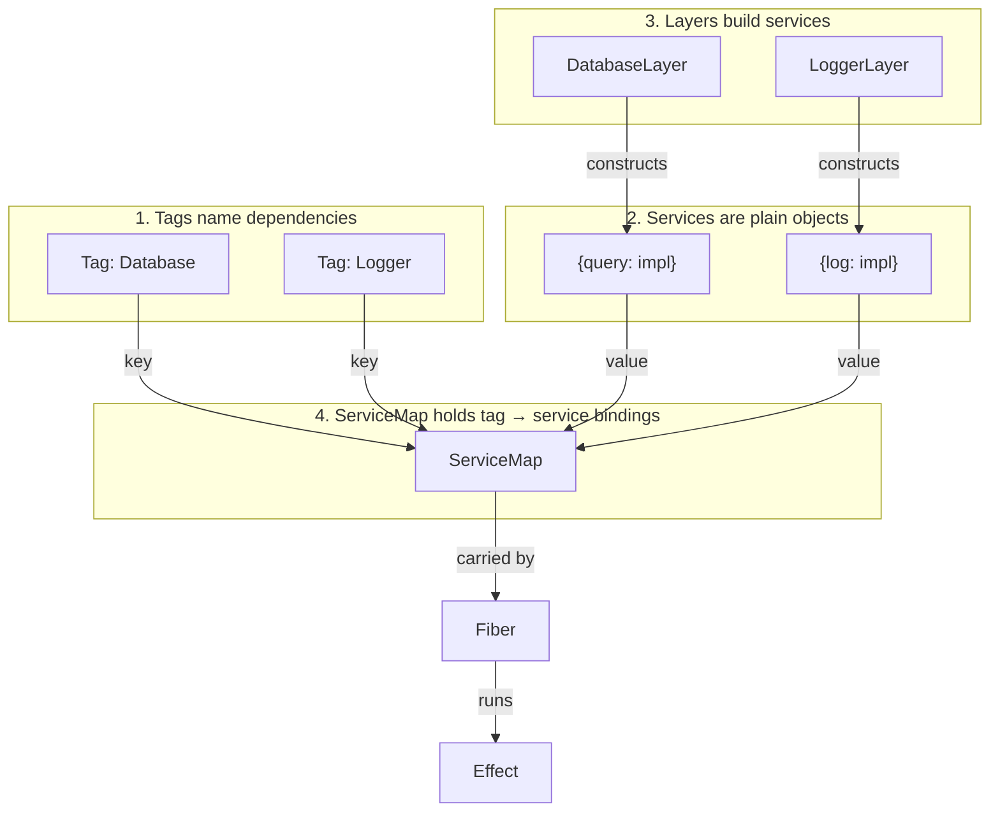
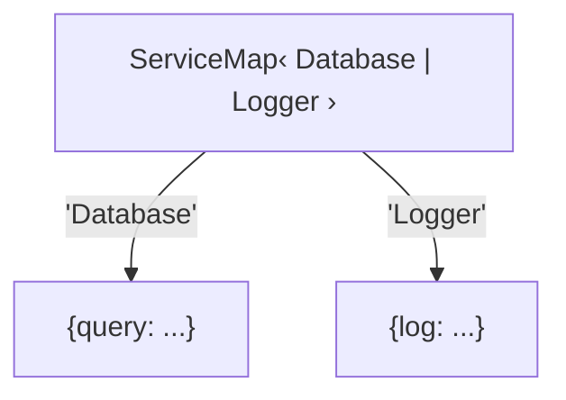
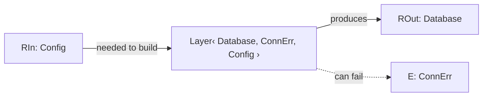
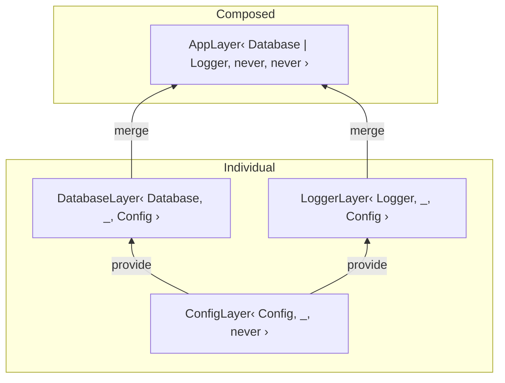
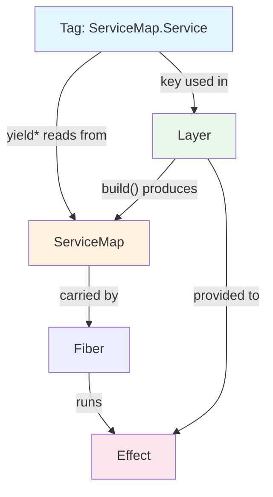

# Effect 4: Tag, Service, Layer, and ServiceMap

Research from `refs/effect4/packages/effect/src/` source and `refs/effect4/migration/` docs.

## The Problem

Every app has dependencies -- a database, a logger, a config. You need to:

1. **Declare** what a dependency looks like (interface)
2. **Request** a dependency inside business logic
3. **Provide** an implementation at the app boundary
4. **Construct** implementations that may themselves need other dependencies, can fail, and need cleanup

Effect splits this into four things:

| Concept                        | Role                                                                  | Analogy                                    |
| ------------------------------ | --------------------------------------------------------------------- | ------------------------------------------ |
| **Tag** (`ServiceMap.Service`) | Names and types a dependency                                          | A labeled plug on the wall: "Database"     |
| **Service** (implementation)   | A plain object that does the actual work, matching the tag's Shape    | The appliance you plug in                  |
| **ServiceMap**                 | Holds tag-to-service bindings at runtime                              | The junction box behind the wall           |
| **Layer**                      | A recipe for constructing services, with deps, effects, and lifecycle | The electrician who wires the junction box |



---

## Tag (`ServiceMap.Service`)

A tag is a typed key. It pairs a runtime string with two compile-time types. It is **not** the implementation -- it's the identifier you use to request and provide one.

```ts
class Database extends ServiceMap.Service<
  Database,
  {
    readonly query: (sql: string) => Effect<string>;
  }
>()("Database") {}
```

Three things in play:

```
ServiceMap.Service< Database,  { readonly query: ... } >()( "Database" )
                    ^^^^^^^^   ^^^^^^^^^^^^^^^^^^^^^^^^      ^^^^^^^^^^
                    Identifier Shape                         runtime key
```

- **Identifier** -- a type (usually the class itself) that appears in `Effect`'s `R` parameter when something needs this dependency
- **Shape** -- the interface contract. Implementations must match this.
- **Runtime key** -- a string used at runtime to look up the implementation in a `ServiceMap`

The implementation is just a plain object matching `Shape`. No wrapper, no base class.

### Type definition (simplified)

```ts
// refs/effect4/packages/effect/src/ServiceMap.ts lines 44-60
interface Service<Identifier, Shape> {
  readonly key: string;
  of(self: Shape): Shape;
  serviceMap(self: Shape): ServiceMap<Identifier>;
  use<A, E, R>(
    f: (service: Shape) => Effect<A, E, R>,
  ): Effect<A, E, R | Identifier>;
  useSync<A>(f: (service: Shape) => A): Effect<A, never, Identifier>;
}
```

- `key` -- the runtime string, e.g. `"Database"`
- `of(impl)` -- identity; type-checks that `impl` matches `Shape`
- `serviceMap(impl)` -- wraps an implementation into a single-entry `ServiceMap`
- `use(fn)` -- reads the implementation from the running fiber, passes it to `fn`
- `useSync(fn)` -- same, but `fn` is pure

### `yield*` on a tag

Tags are `Yieldable`. Inside `Effect.gen`, `yield*` on a tag reads the implementation from the fiber's ServiceMap:

```ts
const program = Effect.gen(function* () {
  const db = yield* Database;
  //    ^^ plain object: { query: ... }
  return yield* db.query("SELECT 1");
});
// program: Effect<string, never, Database>
//                                ^^^^^^^^ Database appears in R
```

Internally (`ServiceMap.ts` line 194):

```ts
asEffect() {
  return withFiber((fiber) => exitSucceed(get(fiber.services, this)))
}
```

### Creating tags

**Function syntax** -- Identifier and Shape are the same type:

```ts
const Database = ServiceMap.Service<Database>("Database");
```

**Class syntax** -- idiomatic, Identifier = the class, Shape = explicit interface:

```ts
class Database extends ServiceMap.Service<
  Database,
  {
    readonly query: (sql: string) => Effect<string>;
  }
>()("Database") {}
```

The double-call `ServiceMap.Service<...>()("Database")` is currying. TypeScript can't partially apply generics, so you provide `<Identifier, Shape>` explicitly in the first call, then `("Database")` is inferred separately.

**Class syntax with `make`** -- attaches a factory Effect:

```ts
class Logger extends ServiceMap.Service<Logger>()("Logger", {
  make: Effect.gen(function* () {
    const config = yield* Config;
    return { log: (msg: string) => Effect.log(`[${config.prefix}] ${msg}`) };
  }),
}) {
  static layer = Layer.effect(this, this.make).pipe(
    Layer.provide(Config.layer),
  );
}
```

With one type param `<Logger>()`, Shape is inferred from `make`'s return type. `Logger.make` is an Effect that produces the implementation. You wire it into a Layer yourself.

### Accessing a tag in an Effect

```ts
// yield* (preferred)
const program = Effect.gen(function* () {
  const db = yield* Database;
  yield* db.query("SELECT 1");
});

// .use callback
const program2 = Database.use((db) => db.query("SELECT 1"));

// Effect.service
const program3 = Effect.service(Database);
```

---

## ServiceMap

A `ServiceMap` is the runtime container. Under the hood it's a `Map<string, any>` where keys are tag strings and values are implementations.

```ts
// refs/effect4/packages/effect/src/ServiceMap.ts lines 359-364
interface ServiceMap<Services> {
  readonly mapUnsafe: ReadonlyMap<string, any>;
}
```

The `Services` type parameter is a union of Identifier types present in the map. `ServiceMap<Database | Logger>` means "contains implementations for both Database and Logger."



### Variance

```ts
interface ServiceMap<in Services> { ... }
```

`in` = contravariant. A map with MORE services is a subtype of one with fewer. `ServiceMap<Database | Logger>` satisfies `ServiceMap<Database>`.

### Operations

```ts
ServiceMap.empty(); // ServiceMap<never>
ServiceMap.make(Database, impl); // ServiceMap<Database>
ServiceMap.add(map, Logger, impl); // ServiceMap<Database | Logger>
ServiceMap.merge(mapA, mapB); // union
ServiceMap.get(map, Database); // typed lookup
ServiceMap.getOption(map, Database); // Option<Shape>
```

### Where it lives at runtime

Every fiber carries a `ServiceMap` in its `services` field. When an Effect does `yield* Database`, it reads from `fiber.services`.

---

## Layer

A Layer is a **recipe for building implementations**. It wraps an Effect that, when run, produces a `ServiceMap`.

### Why not just provide plain values?

`Effect.provideService(program, Database, impl)` works when `impl` is a ready-made value. But real implementations often:

- **Depend on other services** -- Database needs Config
- **Require effectful setup** -- opening a connection pool can fail
- **Need cleanup** -- the pool must close on shutdown
- **Should be shared** -- two consumers shouldn't create two pools

A plain value can't express any of this. A Layer can.

### Type signature

```ts
// refs/effect4/packages/effect/src/Layer.ts lines 41-55
interface Layer<ROut, E, RIn> {
  build(memoMap: MemoMap, scope: Scope): Effect<ServiceMap<ROut>, E, RIn>;
}
```

```
Layer<ROut, E, RIn>
      ^^^^  ^  ^^^
      |     |  |
      |     |  What this layer NEEDS to be built (input dependencies)
      |     |
      |     What can go wrong during construction
      |
      What this layer PROVIDES once built (output services)
```



### Constructors (simplest to most powerful)

```ts
// From a ready value (no effects, no deps, no cleanup)
Layer.succeed(Database)({ query: (sql) => Effect.succeed("result") });
// Layer<Database, never, never>

// From a lazy value
Layer.sync(Database)(() => ({ query: (sql) => Effect.succeed("result") }));
// Layer<Database, never, never>

// From an Effect (effectful construction, can have deps and lifecycle)
Layer.effect(Database)(
  Effect.gen(function* () {
    const config = yield* Config;
    const pool = yield* Effect.acquireRelease(
      openPool(config.connectionString),
      (pool) => pool.close(),
    );
    return { query: (sql) => pool.execute(sql) };
  }),
);
// Layer<Database, PoolError, Config>
//       ^^^^^^^^  ^^^^^^^^^  ^^^^^^
//       provides   can fail   needs Config to build

// Side-effect only (provides nothing)
Layer.effectDiscard(Effect.log("Starting..."));
// Layer<never, never, never>
```

### Composition

Layers compose declaratively. This is the main reason they exist.

**`Layer.merge`** -- combine outputs (built concurrently):

```ts
Layer.merge(DatabaseLayer, LoggerLayer);
// Layer<Database | Logger, never, Config>
```

**`Layer.mergeAll`** -- combine N layers:

```ts
Layer.mergeAll(DatabaseLayer, LoggerLayer, AuthLayer);
```

**`Layer.provide`** -- feed one layer's output into another's input:

```ts
const DatabaseLayer; // Layer<Database, never, Config>
const ConfigLayer; // Layer<Config, never, never>

DatabaseLayer.pipe(Layer.provide(ConfigLayer));
// Layer<Database, never, never>
//                       ^^^^^ Config requirement eliminated
```

**`Layer.provideMerge`** -- provide + keep both outputs:

```ts
DatabaseLayer.pipe(Layer.provideMerge(ConfigLayer));
// Layer<Database | Config, never, never>
```



### Memoization (sharing)

Layers are shared by default. If the same Layer object appears twice in a composition tree, it's built once.

```ts
const ConfigLayer = Layer.sync(Config)(() => {
  console.log("building config") // prints ONCE
  return { prefix: "app", port: 8080 }
})

const DatabaseLayer = /* needs Config */.pipe(Layer.provide(ConfigLayer))
const LoggerLayer   = /* needs Config */.pipe(Layer.provide(ConfigLayer))

// ConfigLayer referenced by both, but built only once
const AppLayer = Layer.merge(DatabaseLayer, LoggerLayer)
```

From `refs/effect4/packages/effect/test/Layer.test.ts` line 30:

```ts
it.effect("sharing with merge", () =>
  Effect.gen(function* () {
    const array: Array<string> = [];
    const layer = makeLayer1(array);
    const env = layer.pipe(Layer.merge(layer), Layer.build);
    yield* Effect.scoped(env);
    assert.deepStrictEqual(array, [acquire1, release1]); // one acquire, not two
  }),
);
```

Opt out: `Layer.fresh(layer)` or `Effect.provide(program, layer, { local: true })`.

### Providing a Layer to an Effect

```ts
const program = Effect.gen(function* () {
  const db = yield* Database;
  return yield* db.query("SELECT 1");
});
// Effect<string, never, Database>

// Via layer
Effect.provide(program, DatabaseLayer);
// Effect<string, ConnErr, never>  -- Database requirement gone

// Via ServiceMap directly
Effect.provide(program, ServiceMap.make(Database, myImpl));

// Via single service
Effect.provideService(program, Database, myImpl);
```

---

## How They Relate

```
Tag             = typed key (names a dependency, defines its interface)
ServiceMap      = runtime container (maps tags to implementations)
Layer           = recipe (Effect that builds a ServiceMap, with deps/lifecycle/sharing)
```



### End-to-end flow

```ts
// 1. DEFINE tags (what dependencies exist)
class Database extends ServiceMap.Service<
  Database,
  {
    readonly query: (sql: string) => Effect<string>;
  }
>()("Database") {}

class Config extends ServiceMap.Service<
  Config,
  {
    readonly connectionString: string;
  }
>()("Config") {}

// 2. USE tags in effects (declare what you need)
const program = Effect.gen(function* () {
  const db = yield* Database;
  return yield* db.query("SELECT 1");
});
// Effect<string, never, Database>

// 3. BUILD layers (define how to construct implementations)
const ConfigLayer = Layer.succeed(Config)({
  connectionString: "postgres://...",
});

const DatabaseLayer = Layer.effect(Database)(
  Effect.gen(function* () {
    const config = yield* Config;
    const pool = yield* Effect.acquireRelease(
      openPool(config.connectionString),
      (pool) => pool.close(),
    );
    return { query: (sql) => pool.execute(sql) };
  }),
);

// 4. COMPOSE layers (wire dependencies)
const AppLayer = DatabaseLayer.pipe(Layer.provide(ConfigLayer));
// Layer<Database, never, never> -- fully wired

// 5. PROVIDE and RUN
Effect.provide(program, AppLayer).pipe(Effect.runPromise);
```

---

## Reference (Tag with a Default)

A Reference is a tag where `Identifier = never`, so it never appears in `R`. It always has a fallback value.

```ts
// refs/effect4/packages/effect/src/ServiceMap.ts lines 236-240
interface Reference<Shape> extends Service<never, Shape> {
  readonly defaultValue: () => Shape;
}
```

```ts
const LogLevel = ServiceMap.Reference<"info" | "warn" | "error">("LogLevel", {
  defaultValue: () => "info",
});

const program = Effect.gen(function* () {
  const level = yield* LogLevel; // "info" by default
});
// Effect<void, never, never> -- no requirement

// Override for a scope
Effect.provideService(program, LogLevel, "warn");
```

Built-in references (`refs/effect4/packages/effect/src/References.ts`):

- `References.CurrentLogLevel` -- default `"Info"`
- `References.CurrentConcurrency` -- default `"unbounded"`
- `References.TracerEnabled` -- default `true`

---

## Why Layers Exist (in addition to Tags + ServiceMap)

Tags and ServiceMap handle **what** and **where**. Layers handle **how**.

| Concern                       | Tags + ServiceMap alone                   | With Layers                                     |
| ----------------------------- | ----------------------------------------- | ----------------------------------------------- |
| Define an interface           | `ServiceMap.Service<Db, Shape>()("Db")`   | same                                            |
| Provide a ready value         | `Effect.provideService(e, Db, impl)`      | `Layer.succeed(Db)(impl)`                       |
| Effectful construction        | manual -- construct outside, pass in      | `Layer.effect(Db)(effectThatBuilds)`            |
| Dependencies between services | manual -- construct in order, pass around | `Layer.provide(depLayer)`                       |
| Resource cleanup              | manual -- track and close yourself        | `Effect.acquireRelease` inside the layer effect |
| Sharing expensive services    | manual -- construct once, pass ref        | automatic via memoization                       |
| Composing an entire app's DI  | imperatively wire everything              | `Layer.mergeAll(...).pipe(Layer.provide(...))`  |

Without layers, you'd write imperative setup code that constructs services in the right order, manages their lifecycles, and threads them through. Layers make this declarative and composable.

---

## Naming Conventions

From `refs/effect4/migration/services.md`:

| Element            | Convention              | Example                               |
| ------------------ | ----------------------- | ------------------------------------- |
| Tag class          | PascalCase noun         | `Database`, `Logger`, `Config`        |
| Runtime key string | Same as class name      | `"Database"`                          |
| Primary layer      | `static layer`          | `Database.layer`                      |
| Variant layers     | `static layer` + suffix | `Database.layerTest`                  |
| Factory effect     | `static make`           | `Database.make`                       |
| Reference          | camelCase or PascalCase | `ServiceMap.Reference<T>("key", ...)` |

v3 used `Default` or `Live`. v4 uses `layer`.

### Idiomatic pattern

```ts
class Database extends ServiceMap.Service<
  Database,
  {
    readonly query: (sql: string) => Effect<ReadonlyArray<Row>>;
  }
>()("Database", {
  make: Effect.gen(function* () {
    const config = yield* Config;
    const pool = yield* Effect.acquireRelease(
      openPool(config.connectionString),
      (p) => p.close(),
    );
    return { query: (sql) => pool.execute(sql) };
  }),
}) {
  static layer = Layer.effect(this, this.make).pipe(
    Layer.provide(Config.layer),
  );
}
```

---

## Type Definitions Broken Down

### `Effect<A, E, R>`

```
Effect<A, E, R>
       ^  ^  ^
       |  |  Requirements -- union of Identifier types this effect needs
       |  |  e.g., Database | Logger
       |  Error -- what can go wrong
       |  e.g., DatabaseError
       Success -- what it produces
       e.g., string
```

### `Layer<ROut, E, RIn>`

```
Layer<ROut, E, RIn>
      ^^^^  ^  ^^^
      |     |  Input -- tags needed to build this layer
      |     |  e.g., Config
      |     Error during construction
      |     e.g., ConnectionError
      Output -- tags this layer provides
      e.g., Database
```

### `ServiceMap.Service<Identifier, Shape>`

```
ServiceMap.Service<Identifier, Shape>
                   ^^^^^^^^^^  ^^^^^
                   |           Interface contract the implementation must satisfy
                   |           e.g., { query: (sql: string) => Effect<string> }
                   Type that appears in R when this dependency is needed
                   e.g., Database (the class)
```

### `ServiceMap<Services>`

```
ServiceMap<Services>
           ^^^^^^^^
           Union of Identifier types for all entries in the map
           e.g., Database | Logger | Config
```

### How `Exclude` eliminates requirements

When you provide a dependency, TypeScript subtracts it from `R`:

```ts
// Before:
//   Effect<string, never, Database | Logger>

Effect.provideService(effect, Database, impl);
// Effect<string, never, Exclude<Database | Logger, Database>>
// = Effect<string, never, Logger>

Effect.provide(effect, fullAppLayer);
// fullAppLayer: Layer<Database | Logger, never, never>
// Effect<string, never, Exclude<Database | Logger, Database | Logger>>
// = Effect<string, never, never>  -- fully satisfied
```

### `Layer.effect` signature step by step

```ts
// refs/effect4/packages/effect/src/Layer.ts lines 764-777
const effect: {
  <I, S>(
    service: ServiceMap.Service<I, S>,
  ): <E, R>(effect: Effect<S, E, R>) => Layer<I, E, Exclude<R, Scope.Scope>>;
};
```

1. Takes a tag (`ServiceMap.Service<I, S>`). Infers `I` = Identifier, `S` = Shape.
2. Returns a function taking `Effect<S, E, R>` -- an effect that produces `S`. Infers `E` and `R`.
3. Returns `Layer<I, E, Exclude<R, Scope.Scope>>`:
   - Provides `I`
   - Can fail with `E`
   - Needs `R` minus `Scope.Scope` (the layer manages its own scope)

---

## ManagedRuntime

At the app boundary, `ManagedRuntime` converts a Layer into something that can run effects:

```ts
// refs/effect4/packages/effect/src/ManagedRuntime.ts
interface ManagedRuntime<R, ER> {
  readonly runPromise: <A, E>(effect: Effect<A, E, R>) => Promise<A>;
  readonly runSync: <A, E>(effect: Effect<A, E, R>) => A;
  readonly dispose: () => Promise<void>;
}

const AppRuntime = ManagedRuntime.make(AppLayer);
await AppRuntime.runPromise(program);
await AppRuntime.dispose();
```

---

## Quick Reference

| I want to...          | Use                                                            |
| --------------------- | -------------------------------------------------------------- |
| Define a dependency   | `class Foo extends ServiceMap.Service<Foo, Shape>()("Foo") {}` |
| Access a dependency   | `yield* Foo` or `Foo.use(fn)`                                  |
| Layer from a value    | `Layer.succeed(Foo)(impl)`                                     |
| Layer from an Effect  | `Layer.effect(Foo)(effect)`                                    |
| Combine layers        | `Layer.merge(a, b)` or `Layer.mergeAll(a, b, c)`               |
| Wire layer deps       | `layer.pipe(Layer.provide(depLayer))`                          |
| Provide to an effect  | `Effect.provide(effect, layer)`                                |
| Provide one service   | `Effect.provideService(effect, Foo, impl)`                     |
| Default-valued config | `ServiceMap.Reference<T>("key", { defaultValue: () => ... })`  |
| Disable sharing       | `Layer.fresh(layer)`                                           |
| Test mock             | `Layer.mock(Foo)({ partial })`                                 |
| Run at boundary       | `ManagedRuntime.make(appLayer)`                                |
