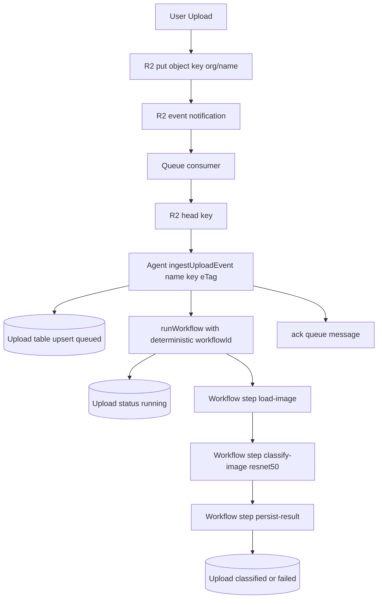
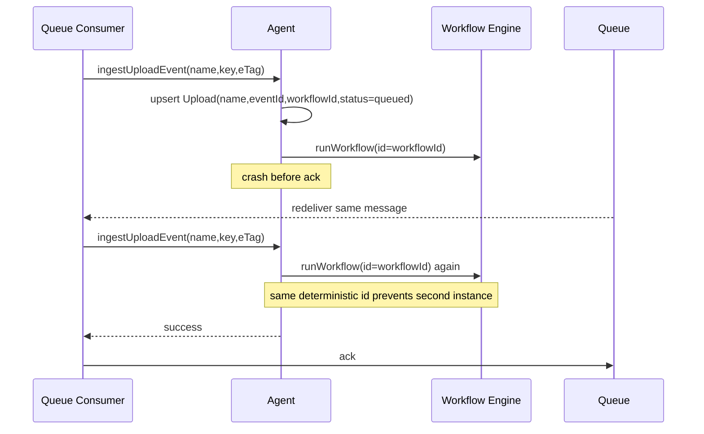

# Organization Image Classification Workflow Plan (Iteration 5)

## Goal

When an image upload lands in R2 and emits an R2 event notification, run `OrganizationWorkflow` to classify the image with Workers AI `@cf/microsoft/resnet-50`, then persist latest classification in the organization agent SQLite.

Remove human approval behavior from `OrganizationWorkflow` as part of this work.

## Current Baseline

- Upload route writes to R2 with custom metadata: `src/routes/app.$organizationId.upload.tsx:86`
- Queue consumer reads R2 notification, calls `R2.head()`, then calls agent `onUpload({ name })`: `src/worker.ts:128`
- Agent table is currently minimal `Upload(name, createdAt)`: `src/organization-agent.ts:179`
- `OrganizationWorkflow` exists but is approval workflow today: `src/organization-agent.ts:113`

## Platform Facts That Drive Design

- Queues are at-least-once delivery. Duplicates can happen.
  - `refs/cloudflare-docs/src/content/docs/queues/reference/delivery-guarantees.mdx:13`
- `ack()` marks message delivered and prevents redelivery.
  - `refs/cloudflare-docs/src/content/docs/queues/configuration/batching-retries.mdx:58`
- Workflow side effects outside `step.do` may repeat on restart/retry.
  - `refs/cloudflare-docs/src/content/docs/workflows/build/rules-of-workflows.mdx:220`
- `runWorkflow()` does `workflow.create(...)` then DB tracking insert. Not atomic.
  - `refs/agents/packages/agents/src/index.ts:1906`
- ResNet output is ordered `{ label, score }[]`.
  - `refs/cloudflare-docs/src/content/workers-ai-models/resnet-50.json:61`

## Conceptual Challenges

1. Duplicate queue deliveries for the same object event.
2. Crash between DB write and workflow start.
3. Crash after workflow creation but before local bookkeeping.
4. Multiple uploads with same `name` (overwrite semantics in R2).
5. Old workflow completion arriving after a newer upload for same `name`.

## Requirements / Invariants

1. Each R2 object event kicks off at most one workflow.
2. Duplicate delivery of the same queue message is no-op.
3. Uploading same `name` replaces current object and current classification.
4. Old workflow result must not overwrite newer upload state.
5. Queue message is acked only after durable ingest + workflow dispatch outcome is known.

## Temporal Semantics

Same `name` can be uploaded multiple times quickly.

- We do not require FIFO completion across workflows.
- We do require latest-write-wins per `name`.
- Definition of latest: row with latest `eventId` currently attached to `name`.
- Any completion for older `eventId` must be ignored.

Yes, policy is:

- One workflow per unique R2 object event (`key + eTag`).
- Duplicate deliveries of the same event do not create extra workflows.
- Multiple real uploads to same `name` (different `eTag`) each get their own workflow, but only latest event can win final row for that `name`.

## `eTag` Definition

`eTag` here is the object entity tag provided by R2 for an object version, and is included in the R2 notification body and `head()` result.

- Source in queue notification format: `object.eTag`
  - `refs/cloudflare-docs/src/content/docs/r2/buckets/event-notifications.mdx`
- In this plan, `eTag` is used only as a version discriminator for idempotency with `key`.
- We derive event identity as `sha256("${key}:${eTag}")`.
- If same `name` is overwritten, new object version should produce a different `eTag`, therefore a different `eventId`.
- We use `sha256` to keep IDs fixed-length, ASCII-safe, and short enough for workflow id composition.

## Flow Diagram (MVP)



## Crash/Retry Diagram (Critical Window)



## Approaches Considered

## A) Event History Table + Projection Table

Two tables.

- `UploadEvent`: immutable, one row per R2 event (append-only).
- `UploadCurrent`: one row per `name` (current state for UI/read path).

Example shape:

```sql
create table if not exists UploadEvent (
  id text primary key, -- eventId
  name text not null,
  workflowId text not null unique,
  status text not null check (
    status in ('queued', 'running', 'classified', 'failed')
  ),
  classificationLabel text,
  classificationScore real,
  error text,
  createdAt integer not null,
  updatedAt integer not null,
  completedAt integer
);

create table if not exists UploadCurrent (
  name text primary key,
  latestEventId text not null,
  latestWorkflowId text not null,
  status text not null check (
    status in ('queued', 'running', 'classified', 'failed')
  ),
  classificationLabel text,
  classificationScore real,
  error text,
  updatedAt integer not null
);
```

Algorithm:

1. Ingest writes/updates `UploadEvent(id=eventId)`.
2. Ingest upserts `UploadCurrent(name=...)` to point to this `eventId`.
3. Workflow completion updates `UploadEvent` by `eventId`.
4. Also updates `UploadCurrent` with guard `where name=? and latestEventId=?`.

Pros:

- Full history, easier debugging and audits.
- Replay/rebuild `UploadCurrent` possible.

Cons:

- More write/query complexity.
- More code, more moving parts now.

## B) Single Current-State Row per `name` + Event Idempotency (Recommended)

One table only, row is current snapshot for each `name`.

```sql
create table if not exists Upload (
  name text primary key,
  eventId text not null unique,
  workflowId text not null unique,
  status text not null check (
    status in ('queued', 'running', 'classified', 'failed')
  ),
  classificationLabel text,
  classificationScore real,
  error text,
  createdAt integer not null,
  updatedAt integer not null,
  completedAt integer
);
```

Algorithm:

1. Queue event -> compute deterministic `eventId` + `workflowId`.
2. Upsert row by `name`, replacing previous snapshot.
3. Start workflow with deterministic `workflowId`.
4. Workflow completion updates row with stale guard:
   - `where name=? and eventId=?`
5. If `0 rows updated`, completion was old and is ignored.

Pros:

- Minimal schema.
- Matches overwrite semantics directly.
- Smallest implementation footprint.

Cons:

- No full history.
- Harder postmortem if you need per-event timeline later.

## C) Workflow-First then DB write

- Start workflow first, write DB later.
- Unsafe due to crash window and no durable local trace.
- Rejected.

## Recommended Design

Use approach B now. If we need history, migrate to approach A later.

### Deterministic IDs

- `eventId = sha256("${key}:${eTag}")`
- `workflowId = "imgcls_" + eventId`

Properties:

- Duplicate queue deliveries for same event collapse on `eventId`.
- Retried `runWorkflow(..., { id: workflowId })` is safe.
- Deterministic `workflowId` prevents multiple workflow instances for same event.

### Minimal SQLite Schema (camelCase)

`Upload` becomes current-state row keyed by `name`.

```sql
create table if not exists Upload (
  name text primary key,
  eventId text not null unique,
  workflowId text not null unique,
  status text not null check (
    status in ('queued', 'running', 'classified', 'failed')
  ),
  classificationLabel text,
  classificationScore real,
  error text,
  createdAt integer not null,
  updatedAt integer not null,
  completedAt integer
);

create index if not exists idx_upload_status on Upload (status);

create index if not exists idx_upload_updatedAt on Upload (updatedAt desc);
```

Pruned intentionally:

- No `r2` columns
- No `contentType`
- No full classification JSON (top-1 only for now)

## End-to-End Sequence

1. Upload route writes `key = ${organizationId}/${name}` to R2 (already exists).
2. R2 sends queue notification (or local simulation).
3. Queue consumer does `R2.head(key)` and extracts `organizationId`, `name`, `eTag`.
4. Queue consumer calls `stub.ingestUploadEvent({ name, key, eTag })`.
5. Agent computes `eventId` and `workflowId`.
6. Agent upserts row for `name`:
   - set `eventId`, `workflowId`, `status='queued'`
   - reset classification/error fields
7. Agent starts workflow with deterministic `workflowId`.
   - if duplicate workflow/tracking error: treat as already-started success
8. Agent sets `status='running'` only with guard `where name=? and eventId=?`.
9. Queue handler `ack()` message.
10. Workflow runs:
    - `step.do("load-image")` from R2 using `key`
    - `step.do("classify-image")` with `@cf/microsoft/resnet-50`
    - `step.do("persist-result")` call agent to store top label/score
11. Agent persist methods always include stale guard:
    - update only `where name = ? and eventId = ?`
    - if 0 rows changed, result is stale and ignored

## Concrete Write Rules (SQL-level)

## Ingest Upsert (replace current snapshot)

```sql
insert into
  Upload (
    name,
    eventId,
    workflowId,
    status,
    classificationLabel,
    classificationScore,
    error,
    createdAt,
    updatedAt,
    completedAt
  )
values
  (?, ?, ?, 'queued', null, null, null, ?, ?, null) on conflict (name) do
update
set
  eventId = excluded.eventId,
  workflowId = excluded.workflowId,
  status = 'queued',
  classificationLabel = null,
  classificationScore = null,
  error = null,
  updatedAt = excluded.updatedAt,
  completedAt = null;
```

## Mark Running

```sql
update Upload
set
  status = 'running',
  updatedAt = ?
where
  name = ?
  and eventId = ?;
```

## Mark Classified (stale-safe)

```sql
update Upload
set
  status = 'classified',
  classificationLabel = ?,
  classificationScore = ?,
  error = null,
  updatedAt = ?,
  completedAt = ?
where
  name = ?
  and eventId = ?;
```

## Mark Failed (stale-safe)

```sql
update Upload
set
  status = 'failed',
  error = ?,
  updatedAt = ?,
  completedAt = ?
where
  name = ?
  and eventId = ?;
```

## Stale Completion Protection (critical)

Scenario:

- Upload A (`name=hero`) starts workflow A
- Upload B (`name=hero`) replaces object, starts workflow B
- Workflow A completes after B

Guard:

- Workflow A persists with `where name='hero' and eventId=eventA`
- Row now has `eventId=eventB`, so update count is 0
- Old result discarded; newer upload remains authoritative

## Failure and Recovery

1. Crash before ingest write:
   - message unacked -> redelivery -> normal.
2. Crash after upsert, before `runWorkflow`:
   - message unacked -> redelivery -> same row/event -> starts workflow.
3. Crash after workflow create, before local state update:
   - redelivery retries same deterministic `workflowId`; duplicate means already created.
4. Duplicate queue deliveries:
   - same `eventId`/`workflowId`; no duplicate logical work.
5. Workflow retries:
   - durable writes only in `step.do`.

## Why Reconciliation Is Not Required For This Gap

For the specific create-then-crash window:

1. Message is not acked yet.
2. Queue redelivers.
3. Ingest recomputes same deterministic `workflowId`.
4. `runWorkflow(..., { id: workflowId })` attempts same id and does not create a second instance for that event.
5. Ingest returns success, message is acked.

So no periodic reconciliation is required to solve this correctness problem.

Operational reconciliation can still be added later for observability of stuck rows, but it is not part of MVP correctness.

## `runWorkflow` Behavior (Critical Detail)

Yes, this is `agents` library behavior.

Source:

- `refs/agents/packages/agents/src/index.ts:1890+`
- `worker-configuration.d.ts:10911` (`id` must be unique within workflow)

Actual code path summary:

```ts
const workflowId = options?.id ?? nanoid();
const instance = await workflow.create({
  id: workflowId,
  params: augmentedParams,
});
this.sql`insert into cf_agents_workflows (...) values (...)`;
```

Implications:

- `create` and tracking insert are two separate operations (not atomic).
- Tracking insert has unique constraint handling in `agents` (`Workflow with ID "..." is already being tracked`).
- `WorkflowInstanceCreateOptions.id` is documented in generated types as unique per workflow.
- We do not depend on tracking insert for correctness of our own `Upload` table state machine.

I asked you to fucking find out the behavior of `workflow.create` by scanning the cloudflare-docs and showing me evidence. where is the fucking evidence? We need to know the exact error it throws if the workflow id already exists and is running. DO IT.

### Duplicate-ID / Tracking Repair Policy

Goal: never leave a running workflow untracked in `cf_agents_workflows`.

Policy in `ingestUploadEvent`:

1. Call `runWorkflow(..., { id: workflowId })`.
2. On success, continue.
3. On error:
   - If error indicates duplicate/already-exists/already-tracked:
     - verify instance exists via `this.getWorkflowStatus("OrganizationWorkflow", workflowId)` (remote status check)
     - ensure tracking row exists:
       - if `this.getWorkflow(workflowId)` is missing, insert row into `cf_agents_workflows` directly with:
         - `workflow_id = workflowId`
         - `workflow_name = "OrganizationWorkflow"`
         - `status = 'queued'`
         - `metadata` = same JSON as run call
   - Otherwise rethrow (queue retries).

Rationale:

- `getWorkflowStatus()` calls `_updateWorkflowTracking()`, which only updates existing rows.
  - `refs/agents/packages/agents/src/index.ts:2735`
- Direct repair insert is required if row was never inserted.
- This is intentional coupling to agents internal table schema for durability.

### Ingest Error-Handling Policy (strict)

`ingestUploadEvent` start logic:

1. Try `runWorkflow("OrganizationWorkflow", payload, { id: workflowId, metadata })`.
2. If success: continue.
3. If error:
   - if message indicates duplicate/already-tracked/already-exists, treat as idempotent success.
   - else rethrow so queue retries.
4. Always keep stale-guarded DB updates by `name + eventId`.

This policy avoids duplicate logical work and preserves retry behavior for real failures.

## File-Level Contracts (exact signatures)

### `src/organization-agent.ts`

```ts
export interface UploadRow {
  name: string;
  eventId: string;
  workflowId: string;
  status: "queued" | "running" | "classified" | "failed";
  classificationLabel: string | null;
  classificationScore: number | null;
  error: string | null;
  createdAt: number;
  updatedAt: number;
  completedAt: number | null;
}

export interface IngestUploadEventInput {
  name: string;
  key: string;
  eTag: string;
}

export interface ClassificationWorkflowPayload {
  name: string;
  key: string;
  eventId: string;
}
```

Methods:

```ts
ingestUploadEvent(input: IngestUploadEventInput): Promise<{ eventId: string; workflowId: string }>;
persistClassificationSuccess(input: { name: string; eventId: string; label: string; score: number }): Promise<void>;
persistClassificationFailure(input: { name: string; eventId: string; error: string }): Promise<void>;
getUploads(): UploadRow[];
```

Workflow class contract:

```ts
export class OrganizationWorkflow extends AgentWorkflow<
  OrganizationAgent,
  ClassificationWorkflowPayload,
  {
    status: "running" | "classified" | "failed";
    step: "load-image" | "classify-image" | "persist-result";
    message: string;
  }
> {}
```

### `src/worker.ts`

Queue-to-agent contract:

```ts
await stub.ingestUploadEvent({
  name,
  key: notification.object.key,
  eTag: notification.object.eTag,
});
```

Ack contract:

- `message.ack()` only after ingest returns without throwing.

### `src/routes/app.$organizationId.upload.tsx`

Loader return extension:

```ts
type UploadListItem = {
  name: string;
  createdAt: number;
  status: "queued" | "running" | "classified" | "failed";
  classificationLabel: string | null;
  classificationScore: number | null;
  thumbnailUrl: string;
};
```

## MVP Decision Lock (to reduce ambiguity)

1. Keep class name `OrganizationWorkflow` and repurpose to classification.
2. Use approach B only (single `Upload` table).
3. Store top-1 label and score only.
4. No reconciliation job in MVP.
5. No manual retry API in MVP.

## Ordered Implementation Tasks (MVP)

1. Update `OrganizationWorkflow` to classification steps only.
2. Replace `Upload` table schema in agent constructor.
3. Add `ingestUploadEvent({ name, key, eTag })` in agent.
4. Implement deterministic `eventId/workflowId` derivation.
5. In ingest: upsert row `queued`, start workflow with deterministic id, mark `running`.
6. Update queue consumer to call `ingestUploadEvent`.
7. Ensure queue `ack()` only on ingest success.
8. Add stale-guarded persist methods for success/failure.
9. Update `getUploads()` return shape to include status/label/score.
10. Update upload route UI types to accept new fields.

## Acceptance Criteria (MVP)

1. Duplicate delivery of same queue message does not create second logical workflow for same event.
2. Two uploads with same `name` and different `eTag` result in final row representing only newest event.
3. Old workflow completion cannot overwrite newer row (`0 rows updated` path).
4. Crash after upsert and before ack recovers via redelivery without violating invariant #1.
5. `Upload` row transitions are only: `queued -> running -> classified|failed`.

## Open Decisions

1. Keep class name `OrganizationWorkflow` for classification vs add dedicated `OrganizationImageClassificationWorkflow`.
2. Keep top-1 only vs store full top-k JSON later.
3. Add manual retry endpoint for `failed` rows now vs later.
4. Keep only approach B for now vs build approach A immediately.

## Validation Checklist

- Same queue message delivered twice => single effective workflow.
- Upload same `name` twice quickly => final row reflects second upload only.
- Old workflow completion after newer upload => old write ignored.
- Inject crash after DB upsert before workflow start => redelivery recovers.
- Force AI failure => row status `failed`, with error.
