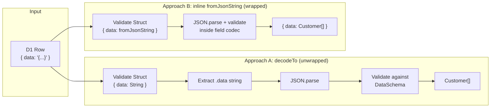

# SchemaEx: D1 Result Validation with Effect 4 Schema

Research for building `src/lib/SchemaEx.ts` — utilities to validate D1 query results using Effect 4 Schema.

## Problem

When using SQLite's `json_object()` / `json_group_array()` to build nested data in a single query, D1 returns a row like:

```json
{ "data": "{\"name\":\"Alice\",\"age\":30}" }
```

The `data` column is a JSON string that needs to be:

1. Extracted from the row object
2. Parsed as JSON
3. Validated against a schema

## cerr's Effect 3 Approach

`refs/cerr/functions/shared/src/SchemaEx.ts` — `DataFromResult`:

```ts
// Effect 3
const DataFromResult = <A, I>(DataSchema: Schema.Schema<A, I>) =>
  Schema.transform(
    Schema.Struct({ data: Schema.String }), // from: D1 row
    Schema.parseJson(DataSchema), // to: parsed + validated
    {
      strict: true,
      decode: (result) => result.data, // extract the string
      encode: (value) => ({ data: value }), // re-wrap for encoding
    },
  );

// Usage in repository:
Schema.decodeUnknown(DataFromResult(Schema.Array(Customer)))(row);
```

The transform does three things in one schema: validates the row shape, extracts the `data` string, and parses + validates the JSON contents.

## Effect 3 → 4 API Mapping

| Effect 3                                         | Effect 4                                                                             |
| ------------------------------------------------ | ------------------------------------------------------------------------------------ |
| `Schema.transform(from, to, { decode, encode })` | `from.pipe(Schema.decodeTo(to, SchemaTransformation.transform({ decode, encode })))` |
| `Schema.parseJson(schema)`                       | `Schema.fromJsonString(schema)`                                                      |
| `Schema.decodeUnknown(schema)`                   | `Schema.decodeUnknownEffect(schema)`                                                 |
| `Schema.decodeUnknownSync(schema)`               | `Schema.decodeUnknownSync(schema)` (unchanged)                                       |
| `Schema.Schema<A, I, R>` (3 type params)         | `Schema.Schema<A>` (simplified, encoded/requirements inferred)                       |

## Two Viable Approaches in Effect 4

### Approach A: Direct Port via `decodeTo` (Unwrapped Result)

Mirrors cerr exactly — the decoded value is the inner type, not wrapped in `{ data: ... }`.

```ts
import { Schema, SchemaTransformation } from "effect";

const DataFromResult = <A>(DataSchema: Schema.Schema<A>) =>
  Schema.Struct({ data: Schema.String }).pipe(
    Schema.decodeTo(
      Schema.fromJsonString(DataSchema),
      SchemaTransformation.transform({
        decode: (result) => result.data,
        encode: (value) => ({ data: value }),
      }),
    ),
  );
```

```ts
const Customer = Schema.Struct({ name: Schema.String, age: Schema.Number });

Schema.decodeUnknownSync(DataFromResult(Schema.Array(Customer)))({
  data: '[{"name":"Alice","age":30}]',
});
// => [{ name: "Alice", age: 30 }]
```

### Approach B: Inline `fromJsonString` on the Field (Wrapped Result)

Embeds JSON parsing directly in the struct field definition. Simpler — no `decodeTo`, no `SchemaTransformation`.

```ts
import { Schema } from "effect";

const DataFromResult = <A>(DataSchema: Schema.Schema<A>) =>
  Schema.Struct({ data: Schema.fromJsonString(DataSchema) });
```

```ts
Schema.decodeUnknownSync(DataFromResult(Schema.Array(Customer)))({
  data: '[{"name":"Alice","age":30}]',
});
// => { data: [{ name: "Alice", age: 30 }] }   ← still wrapped in { data: ... }
```

Consumer must access `.data`:

```ts
const result = Schema.decodeUnknownSync(DataFromResult(Schema.Array(Customer)))(
  row,
);
const customers = result.data; // [{ name: "Alice", age: 30 }]
```

## Comparing the Two Approaches



|                         | Approach A (`decodeTo`)                       | Approach B (inline `fromJsonString`) |
| ----------------------- | --------------------------------------------- | ------------------------------------ |
| **Result type**         | `A` (unwrapped)                               | `{ data: A }` (wrapped)              |
| **Complexity**          | Uses `decodeTo` + `SchemaTransformation`      | Single `Schema.Struct` call          |
| **Consumer ergonomics** | Direct value, no unwrapping                   | Must access `.data`                  |
| **Round-trip encoding** | Full encode support back to `{ data: "..." }` | Full encode support                  |
| **Lines of code**       | ~8                                            | ~2                                   |

### Which to choose?

Approach B is simpler and idiomatic Effect 4, but it changes the consumer API — every call site accesses `.data`. This is fine if the repository method does the unwrapping:

```ts
// In a future Repository method
const getCustomers = Effect.gen(function* () {
  const d1 = yield* D1;
  const row = yield* d1.first(stmt);
  const { data } = Schema.decodeUnknownSync(
    DataFromResult(Schema.Array(Customer)),
  )(row);
  return data;
});
```

If many call sites decode and the `.data` unwrap is noisy, Approach A keeps the same ergonomics as cerr. The `decodeTo` + `SchemaTransformation.transform` is more ceremony but it's a one-time cost in `SchemaEx.ts` — consumers never see it.

**Recommendation:** Start with Approach B for simplicity. If the `.data` unwrap becomes repetitive, switch to Approach A — or add a thin wrapper:

```ts
const decodeDataResult = <A>(schema: Schema.Schema<A>) => {
  const codec = DataFromResult(schema);
  return (input: unknown) => Schema.decodeUnknownSync(codec)(input).data;
};
```

## Usage Pattern: Repository → SQL → Schema


SQL query pattern that produces the `{ data: "..." }` shape:

```sql
select
  json_group_array (json_object ('name', u.name, 'age', u.age)) as data
from
  users u
where
  u.org_id = ? 1
```

## Files

| File                       | Role                                                        |
| -------------------------- | ----------------------------------------------------------- |
| `src/lib/SchemaEx.ts`      | To be created — `DataFromResult` + future utilities         |
| `src/lib/d1.ts`            | Existing D1 service — returns raw `D1Result`, no validation |
| Future Repository services | Will compose `D1` + `SchemaEx` for validated queries        |

## References

- `refs/cerr/functions/shared/src/SchemaEx.ts` — Effect 3 source
- `refs/effect4/packages/effect/SCHEMA.md` — Effect 4 Schema docs (8096 lines)
  - `Schema.fromJsonString`: line 6928
  - `Schema.decodeTo`: line 2639
  - `SchemaTransformation.transform`: line 391
  - v3→v4 migration of `Schema.transform`: line 7740
  - v3→v4 migration of `parseJson`: line 8028
