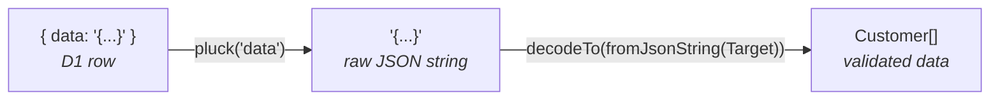
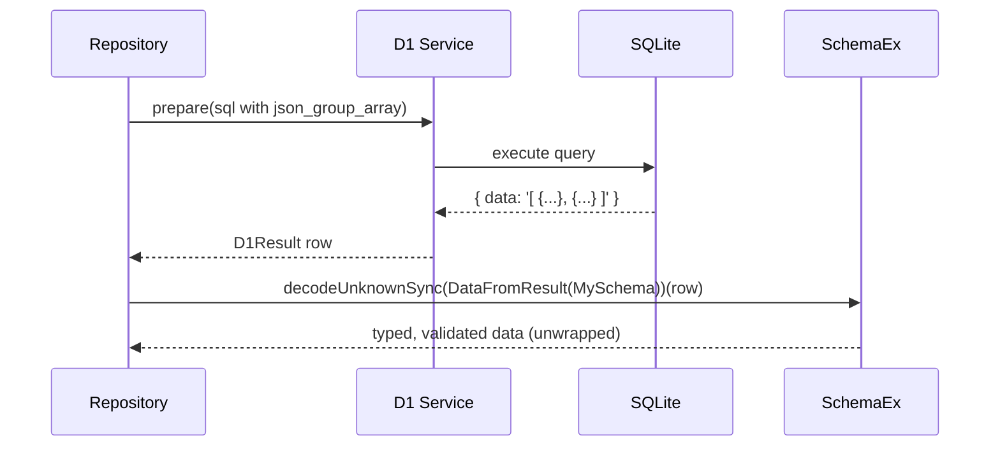

# SchemaEx: D1 Result Validation with Effect 4 Schema

Research for building `src/lib/SchemaEx.ts` — utilities to validate D1 query results using Effect 4 Schema.

## Problem

When using SQLite's `json_object()` / `json_group_array()` to build nested data in a single query, D1 returns a row like:

```json
{ "data": "{\"name\":\"Alice\",\"age\":30}" }
```

The `data` column is a JSON string that needs to be:

1. Extracted from the row object
2. Parsed as JSON
3. Validated against a schema

The consumer should get the unwrapped value directly (e.g. `Customer[]`), not `{ data: Customer[] }`.

## cerr's Effect 3 Approach

`refs/cerr/functions/shared/src/SchemaEx.ts` — `DataFromResult`:

```ts
// Effect 3
const DataFromResult = <A, I>(DataSchema: Schema.Schema<A, I>) =>
  Schema.transform(
    Schema.Struct({ data: Schema.String }),
    Schema.parseJson(DataSchema),
    {
      strict: true,
      decode: (result) => result.data,
      encode: (value) => ({ data: value }),
    },
  );

// Usage in repository:
Schema.decodeUnknown(DataFromResult(Schema.Array(Customer)))(row);
// => Customer[]  (unwrapped)
```

The transform does three things in one schema: validates the row shape, extracts the `data` string, and parses + validates the JSON contents.

## Effect 3 → 4 API Mapping

| Effect 3                                         | Effect 4                                                                             |
| ------------------------------------------------ | ------------------------------------------------------------------------------------ |
| `Schema.transform(from, to, { decode, encode })` | `from.pipe(Schema.decodeTo(to, SchemaTransformation.transform({ decode, encode })))` |
| `Schema.parseJson(schema)`                       | `Schema.fromJsonString(schema)`                                                      |
| `Schema.decodeUnknown(schema)`                   | `Schema.decodeUnknownEffect(schema)`                                                 |
| `Schema.decodeUnknownSync(schema)`               | `Schema.decodeUnknownSync(schema)` (unchanged)                                       |
| `Schema.Schema<A, I, R>` (3 type params)         | `Schema.Schema<A>` (simplified, encoded/requirements inferred)                       |

## Effect 4 Approach: `pluck` + Schema Composition

Effect 4 has two building blocks that compose to replicate `DataFromResult`:

1. **`pluck`** — a documented recipe (SCHEMA.md:7262) that extracts a single field from a struct and returns the unwrapped value
2. **Schema composition via `decodeTo` without a transformation** — chains two schemas where the output type of the first matches the input type of the second (SCHEMA.md:2733)

### The Pipeline



`pluck("data")` is a schema that:

- **Decodes:** `{ data: string }` → `string` (extracts the field)
- **Encodes:** `string` → `{ data: string }` (re-wraps for round-trip)

`Schema.decodeTo(Schema.fromJsonString(Target))` without a transformation argument performs **schema composition** — it chains the `string` output of `pluck` into `fromJsonString` which parses the JSON and validates against `Target`.

### The `pluck` Recipe

From SCHEMA.md:7262-7304. This is not a built-in export — it's a documented recipe using `mapFields`, `Struct.pick`, `SchemaGetter.transform`, and `Schema.decodeTo`:

```ts
import { Schema, SchemaGetter, Struct } from "effect";

function pluck<P extends PropertyKey>(key: P) {
  return <S extends Schema.Top>(
    schema: Schema.Struct<{ [K in P]: S }>,
  ): Schema.decodeTo<Schema.toType<S>, Schema.Struct<{ [K in P]: S }>> => {
    return schema.mapFields(Struct.pick([key])).pipe(
      Schema.decodeTo(Schema.toType(schema.fields[key]), {
        decode: SchemaGetter.transform((whole: any) => whole[key]),
        encode: SchemaGetter.transform((value) => ({ [key]: value }) as any),
      }),
    );
  };
}
```

How it works:

- `schema.mapFields(Struct.pick([key]))` — narrows the struct to only the target field
- `Schema.decodeTo(Schema.toType(...), { decode, encode })` — unwraps/wraps the field value using `SchemaGetter.transform`

### `DataFromResult` in Effect 4

Composes `pluck` with `fromJsonString`:

```ts
import { Schema, SchemaGetter, Struct } from "effect";

const DataFromResult = <A>(DataSchema: Schema.Schema<A>) =>
  Schema.Struct({ data: Schema.String }).pipe(
    pluck("data"),
    Schema.decodeTo(Schema.fromJsonString(DataSchema)),
  );
```

Usage (same ergonomics as cerr):

```ts
const Customer = Schema.Struct({ name: Schema.String, age: Schema.Number });

Schema.decodeUnknownSync(DataFromResult(Schema.Array(Customer)))({
  data: '[{"name":"Alice","age":30}]',
});
// => [{ name: "Alice", age: 30 }]

Schema.decodeUnknownSync(DataFromResult(Customer))({
  data: '{"name":"Alice","age":30}',
});
// => { name: "Alice", age: 30 }
```

### Why This is Idiomatic Effect 4

- **`pluck`** uses `mapFields` + `SchemaGetter.transform` — the documented patterns for struct field manipulation (SCHEMA.md:7262)
- **Schema composition** via `decodeTo` without a transformation replaces Effect 3's `Schema.compose` (SCHEMA.md:7601)
- **`fromJsonString`** is the v4 replacement for `Schema.parseJson` (SCHEMA.md:8055)
- Each step is a reusable, composable schema — no manual `JSON.parse` calls, proper error messages from `SchemaIssue` on parse failure

### Full Decode Pipeline



SQL query pattern that produces the `{ data: "..." }` shape:

```sql
select
  json_group_array (json_object ('name', u.name, 'age', u.age)) as data
from
  users u
where
  u.org_id = ? 1
```

## Files

| File                       | Role                                                        |
| -------------------------- | ----------------------------------------------------------- |
| `src/lib/SchemaEx.ts`      | To be created — `DataFromResult`, `pluck`, future utilities |
| `src/lib/d1.ts`            | Existing D1 service — returns raw `D1Result`, no validation |
| Future Repository services | Will compose `D1` + `SchemaEx` for validated queries        |

## References

- `refs/cerr/functions/shared/src/SchemaEx.ts` — Effect 3 source
- `refs/effect4/packages/effect/SCHEMA.md` — Effect 4 Schema docs (8096 lines)
  - `pluck` recipe: line 7262
  - `Schema.decodeTo` (composition without transform): line 2733
  - `Schema.fromJsonString`: line 6928
  - `SchemaTransformation.transform`: line 391 (SchemaTransformation.ts)
  - `SchemaGetter.transform`: line 7276
  - v3→v4 migration of `Schema.transform`: line 7740
  - v3→v4 migration of `parseJson` → `fromJsonString`: line 8028
  - v3→v4 migration of `compose` → `decodeTo`: line 7601
