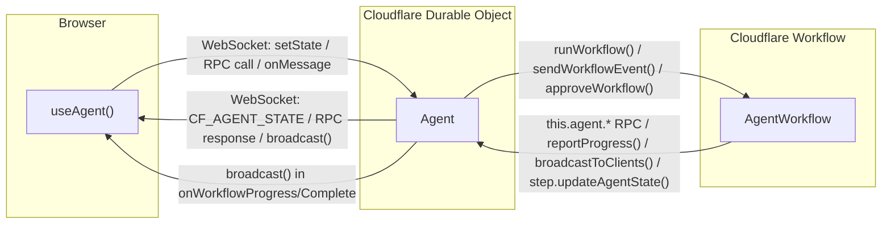

# WebSocket Protocol: useAgent ↔ Agent ↔ AgentWorkflow

## Architecture Overview



[View on mermaid.live](https://mermaid.live) — paste the diagram code above into the editor.

## Why WebSockets?

HTTP is request-response: the client asks, the server answers, the connection is done. The server can never initiate a message to the client unprompted. To get real-time updates you'd have to poll.

WebSocket is a persistent, open connection after a single HTTP handshake. Both sides can send messages at any time, independently. Full-duplex — two independent channels (one per direction) over a single TCP connection. Messages arrive intact, in order per direction, and the two directions don't interfere.

```
HTTP:
  Client: "Any updates?"  →  Server: "No"
  Client: "Any updates?"  →  Server: "No"
  Client: "Any updates?"  →  Server: "Yes, here's data"

WebSocket:
  [connection opens, stays open]
  Client: sends message whenever it wants  →
  ← Server: pushes message whenever it wants
```

## The Protocol: `type` as Discriminator

Every message in both directions is a JSON string with a `type` field. The receiver parses the JSON, checks `type`, and routes accordingly.

**Source:** `refs/agents/packages/agents/src/types.ts`

```ts
enum MessageType {
  CF_AGENT_STATE       = "cf_agent_state",
  CF_AGENT_IDENTITY    = "cf_agent_identity",
  CF_AGENT_MCP_SERVERS = "cf_agent_mcp_servers",
  RPC                  = "rpc",
}
```

> Note: `rpc` breaks the `cf_` prefix convention used by the other internal message types.

## Message Formats

### Client → Agent (2 message types)

#### State Update

```json
{ "type": "cf_agent_state", "state": { "count": 5 } }
```

Sent by `agent.setState()`:

```ts
// refs/agents/packages/agents/src/react.tsx#L617-L619
agent.setState = (state) => {
  agent.send(JSON.stringify({ state, type: MessageType.CF_AGENT_STATE }));
};
```

#### RPC Request

```json
{ "type": "rpc", "id": "abc-123", "method": "saveResult", "args": ["task1", {}] }
```

Sent by `agent.call()` or `agent.stub.someMethod()`:

```ts
// refs/agents/packages/agents/src/react.tsx#L596-L611
const request: RPCRequest = { args, id, method, type: MessageType.RPC };
agent.send(JSON.stringify(request));
```

The `id` (UUID) correlates the response back to the pending Promise.

### Agent → Client (4 message types)

#### Identity (sent on connect)

```json
{ "type": "cf_agent_identity", "name": "default", "agent": "my-agent" }
```

Sent immediately on WebSocket connection. Source: `refs/agents/packages/agents/src/index.ts#L802-L808`.

#### State Update

```json
{ "type": "cf_agent_state", "state": { "count": 5 } }
```

Sent on connect (initial state sync) and broadcast to all clients whenever `setState()` is called. Source: `refs/agents/packages/agents/src/index.ts#L937-L943`.

#### RPC Response

Success:
```json
{ "type": "rpc", "id": "abc-123", "success": true, "result": 42, "done": true }
```

Streaming chunk:
```json
{ "type": "rpc", "id": "abc-123", "success": true, "result": "partial", "done": false }
```

Error:
```json
{ "type": "rpc", "id": "abc-123", "success": false, "error": "Not found" }
```

Source: `refs/agents/packages/agents/src/index.ts#L764-L781`.

#### MCP Servers

```json
{ "type": "cf_agent_mcp_servers", "mcp": { ... } }
```

### Summary Table

| Direction | Message | `type` | Key fields |
|---|---|---|---|
| Client → Agent | Set state | `cf_agent_state` | `state` |
| Client → Agent | RPC call | `rpc` | `id`, `method`, `args` |
| Agent → Client | Identity | `cf_agent_identity` | `name`, `agent` |
| Agent → Client | State push | `cf_agent_state` | `state` |
| Agent → Client | RPC response | `rpc` | `id`, `success`, `result`/`error`, `done` |
| Agent → Client | MCP servers | `cf_agent_mcp_servers` | `mcp` |

## Message Routing

### Server Side: Agent `onMessage`

The Agent parses JSON, checks type guards, and routes. Anything unrecognized falls through to the user-overridable `onMessage`.

```ts
// refs/agents/packages/agents/src/index.ts#L674-L787
parsed = JSON.parse(message);

if (isStateUpdateMessage(parsed)) {   // type === "cf_agent_state"
  this._setStateInternal(parsed.state, connection);
  return;
}

if (isRPCRequest(parsed)) {           // type === "rpc"
  // look up method, execute, send RPCResponse back
  return;
}

// anything else → user's onMessage() handler
```

On the server side, you typically don't handle messages directly. Use `@callable` on methods and let the library route RPC calls.

### Client Side: `useAgent` `onMessage`

Same if-chain pattern with early returns:

```ts
// refs/agents/packages/agents/src/react.tsx#L458-L553
parsedMessage = JSON.parse(message.data);

if (parsedMessage.type === "cf_agent_identity")    { /* handle */ return; }
if (parsedMessage.type === "cf_agent_state")       { onStateUpdate(state, "server"); return; }
if (parsedMessage.type === "cf_agent_mcp_servers") { onMcpUpdate(mcp); return; }
if (parsedMessage.type === "rpc")                  { /* resolve/reject pending promise by id */ return; }

options.onMessage?.(message);  // ← nothing matched → user's handler
```

**What the client developer handles:** Only custom broadcast messages — when the Agent calls `this.broadcast(JSON.stringify({...}))`. These arrive as raw `MessageEvent` with no typing:

```ts
const agent = useAgent<MyAgent, MyState>({
  agent: "my-agent",
  onStateUpdate: (state) => { /* typed as MyState */ },
  onMessage: (event) => {
    // raw MessageEvent — parse and discriminate yourself
    const data = JSON.parse(event.data);
    if (data.type === "workflow-progress") { /* ... */ }
    if (data.type === "task-complete") { /* ... */ }
  },
});
```

The `MessageType` enum only covers library-internal types. Custom broadcast messages have no enforced schema — define your own discriminated union.

## RPC Correlation

Multiple RPC calls can be in-flight simultaneously. The `id` (UUID) ties each response to its request:

```
Client sends:  { type: "rpc", id: "aaa", method: "getUser",  args: [1] }
Client sends:  { type: "rpc", id: "bbb", method: "getOrder", args: [5] }
Agent replies: { type: "rpc", id: "bbb", success: true, result: {...}, done: true }
Agent replies: { type: "rpc", id: "aaa", success: true, result: {...}, done: true }
```

Order of responses doesn't matter. The client stores `Map<id, { resolve, reject }>` in a ref and matches responses by `id`.

## Type Safety

The WebSocket wire protocol is untyped JSON. Type safety is layered on top at compile time via TypeScript generics.

**State:** `useAgent<Agent, State>` parameterizes `setState` and `onStateUpdate`. At runtime, it's a cast (`parsedMessage.state as State`).

**RPC stub:** `agent.stub` is a `Proxy` that at runtime sends `{ type: "rpc", method, args }`, but at compile time TypeScript extracts method signatures from the Agent class via `AgentMethods<T>` — giving full autocomplete on method names, parameters, and return types.

**Server validation:** Runtime-only. Checks that the method exists (`typeof methodFn !== "function"`) and is callable (`this._isCallable(method)`). No schema validation on args.

| Layer | Mechanism | Enforced when? |
|---|---|---|
| State shape | Generic `<State>` | Compile time only |
| RPC method names | `AgentMethods<T>` type extraction | Compile time only |
| RPC param types | `Parameters<AgentMethods<T>[K]>` | Compile time only |
| RPC return types | `AgentPromiseReturnType<T, K>` | Compile time only |
| Method exists | `typeof methodFn !== "function"` | Runtime |
| Method is callable | `this._isCallable(method)` | Runtime |

## Agent ↔ AgentWorkflow Communication

No WebSocket between these two — communication is via Durable Object RPC and Workflow events.

### Agent → Workflow

```ts
// Start workflow (injects __agentName, __agentBinding, __workflowName into params)
const id = await this.runWorkflow("PROCESSING_WORKFLOW", { taskId, data });

// Send event to a paused workflow (e.g., for step.waitForEvent())
await this.sendWorkflowEvent("MY_WORKFLOW", instanceId, { type: "custom", payload });

// Convenience methods for approval flows
await this.approveWorkflow(instanceId, { reason: "OK", metadata: { by: userId } });
await this.rejectWorkflow(instanceId, { reason: "Denied" });
```

### Workflow → Agent

`AgentWorkflow._initAgent()` obtains a typed DO stub via `getAgentByName()`. Three internal RPC methods on Agent:

| Internal RPC Method | Triggered by | What it does |
|---|---|---|
| `_workflow_handleCallback(callback)` | `reportProgress()`, `step.reportComplete()`, `step.reportError()`, `step.sendEvent()` | Routes to `onWorkflowProgress/Complete/Error/Event` |
| `_workflow_broadcast(message)` | `broadcastToClients(msg)` | Calls `this.broadcast(JSON.stringify(msg))` — pushes to all `useAgent` clients |
| `_workflow_updateState(action, state)` | `step.updateAgentState()`, `step.mergeAgentState()`, `step.resetAgentState()` | Calls `setState()` on Agent — broadcasts to all clients |

### Durable vs Non-Durable Operations

| Operation | Durability | Repeats on retry? |
|---|---|---|
| `this.reportProgress()` | Non-durable | Yes |
| `this.broadcastToClients()` | Non-durable | Yes |
| Direct RPC (`this.agent.method()`) | Non-durable | Yes |
| `step.reportComplete()` / `step.reportError()` | Durable (wrapped in `step.do`) | No |
| `step.sendEvent()` | Durable | No |
| `step.updateAgentState()` / `step.mergeAgentState()` | Durable | No |

### Workflow → useAgent (Indirect)

No direct connection. All communication goes through the Agent:

```ts
// Agent bridges workflow progress to useAgent clients
async onWorkflowProgress(workflowName, instanceId, progress) {
  this.broadcast(JSON.stringify({ type: "workflow-progress", workflowName, instanceId, progress }));
}
```

These broadcast messages arrive in the client's `onMessage` handler (not `onStateUpdate`).

## Source References

- `refs/agents/packages/agents/src/types.ts` — `MessageType` enum
- `refs/agents/packages/agents/src/react.tsx` — `useAgent` hook, client-side message routing
- `refs/agents/packages/agents/src/index.ts` — Agent class, server-side message routing, internal RPC methods
- `refs/agents/packages/agents/src/workflows.ts` — `AgentWorkflow` class
- `refs/agents/packages/agents/src/workflow-types.ts` — workflow callback types, `AgentWorkflowStep`
- `refs/agents/docs/workflows.md` — bidirectional communication docs
- `refs/cloudflare-docs/src/content/docs/agents/concepts/workflows.mdx` — Cloudflare docs on Agent-Workflow communication
